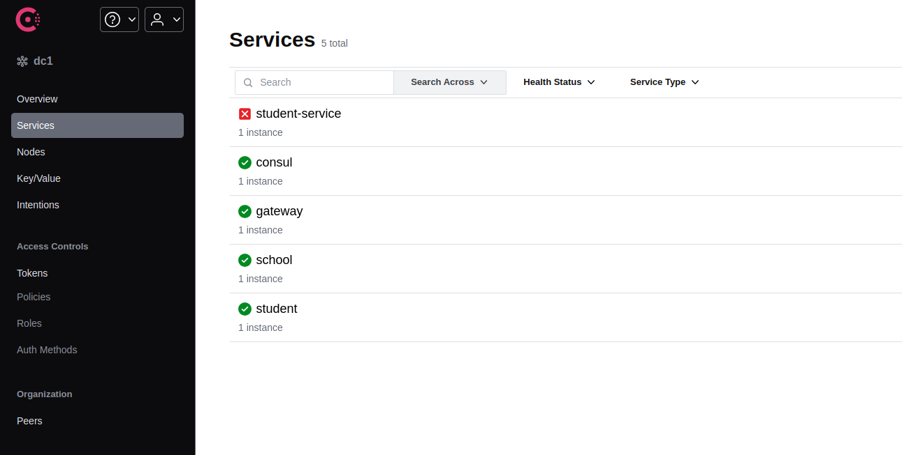

# Documentation du Projet de Microservices

## Description du Projet
Ce projet est une architecture de microservices développée avec Laravel, implémentant trois services principaux : **School**, **Student** et **Gateway**. Le système utilise **Consul** pour la découverte de services et combine **PostgreSQL** et **MongoDB** comme bases de données.

---

### Visualisation des Services dans Consul

Voici une capture d'écran de l'interface **Consul**, affichant les services enregistrés et en cours d'exécution :



## Technologies Utilisées

### Frameworks et Langages
- **Laravel 11** (Service School)
- **Laravel 10** (Service Student)
- **Laravel** (Service Gateway)
- **PHP 8.2**
- **Docker** et **Docker Compose**

### Bases de Données
- **PostgreSQL** (Service School)
- **MongoDB** (Service Student)

### Outils et Services
- **Consul** (Service Discovery)
- **PgAdmin 4** (Interface PostgreSQL)
- **Mongo Express** (Interface MongoDB)

---

## Structure du Projet

```plaintext
project/
├── school/              # Service School (Laravel 11)
├── student/             # Service Student (Laravel 10)
├── gateway/             # Service Gateway (Laravel)
└── docker-compose.yml   # Configuration Docker
```

---

## Configuration des Ports

- **School Service**: [http://localhost:8002](http://localhost:8002)
- **Student Service**: [http://localhost:8001](http://localhost:8001)
- **Gateway Service**: [http://localhost:8003](http://localhost:8003)
- **Consul UI**: [http://localhost:8500](http://localhost:8500)
- **PgAdmin**: [http://localhost:8888](http://localhost:8888)
- **MongoDB Express**: [http://localhost:8081](http://localhost:8081)
- **PostgreSQL**: Port `5450`
- **MongoDB**: Port `27018`

---

## Installation et Démarrage

### Prérequis
- **Docker** et **Docker Compose** installés
- **Git**

### Étapes d'Installation

1. **Cloner le repository**
   ```bash
   git clone [URL_DU_REPO]
   cd [NOM_DU_PROJET]
   ```

2. **Configuration des variables d'environnement**

   - Pour le service **School** (`.env`):
     ```env
     DB_CONNECTION=pgsql
     DB_HOST=db
     DB_PORT=5432
     DB_DATABASE=school_db
     DB_USERNAME=islem
     DB_PASSWORD=password
     ```

   - Pour le service **Student** (`.env`):
     ```env
     DB_CONNECTION=mongodb
     DB_HOST=mongo
     DB_PORT=27017
     DB_DATABASE=db_mongo_service
     DB_USERNAME=root
     DB_PASSWORD=rootpassword
     ```

   - Pour le service **Gateway** (`.env`):
     ```env
     CONSUL_HTTP_ADDR=http://consul:8500
     ```

3. **Démarrer les services**
   ```bash
   docker-compose up -d
   ```

4. **Installer les dépendances dans chaque service**

   - Pour **School**:
     ```bash
     docker-compose exec school composer install
     docker-compose exec school php artisan migrate
     ```

   - Pour **Student**:
     ```bash
     docker-compose exec student composer install
     ```

   - Pour **Gateway**:
     ```bash
     docker-compose exec gateway composer install
     ```

---

## Accès aux Interfaces

### PgAdmin
- **URL**: [http://localhost:8888](http://localhost:8888)
- **Email**: `islemharoun@gmail.com`
- **Mot de passe**: `password`

### Mongo Express
- **URL**: [http://localhost:8081](http://localhost:8081)
- **Username**: `root`
- **Password**: `rootpassword`

### Consul
- **URL**: [http://localhost:8500](http://localhost:8500)

---

## Test des API

### Service School

- **Créer une école**
  ```bash
  curl -X POST http://localhost:8002/api/schools \
  -H "Content-Type: application/json" \
  -d '{"name":"École Test","address":"123 rue Test","director_name":"John Doe"}'
  ```

- **Lister les écoles**
  ```bash
  curl http://localhost:8002/api/schools
  ```

### Service Student

- **Créer un étudiant**
  ```bash
  curl -X POST http://localhost:8001/api/students \
  -H "Content-Type: application/json" \
  -d '{"name":"John Doe","genre":"M","school_id":1}'
  ```

- **Lister les étudiants**
  ```bash
  curl http://localhost:8001/api/students
  ```

### Service Gateway

- **Proxy vers les autres services**
  ```bash
  curl http://localhost:8003/<service_endpoint>
  ```
  Exemple :
  ```bash
  curl http://localhost:8003/api/schools
  ```

---

## Architecture et Communications

- Les services communiquent entre eux via **HTTP**.
- **Consul** gère la découverte des services.
- Chaque service a sa propre base de données :
  - **School** utilise PostgreSQL pour la persistance des données.
  - **Student** utilise MongoDB pour le stockage.

---

## Notes sur les Tests

Pour tester les services, vous pouvez utiliser **Postman** ou **curl**. Les endpoints principaux sont :

- **Schools**: [http://localhost:8002/api/schools](http://localhost:8002/api/schools)
- **Students**: [http://localhost:8001/api/students](http://localhost:8001/api/students)
- **Gateway**: [http://localhost:8003](http://localhost:8003)

---

## Dépannage

1. **Vérifier les logs des services**
   ```bash
   docker-compose logs school
   docker-compose logs student
   docker-compose logs gateway
   ```

2. **Redémarrer les services**
   ```bash
   docker-compose down
   docker-compose up -d
   ```

3. **Vérifier les connexions aux bases de données**

   - **PostgreSQL**:
     ```bash
     docker-compose exec db psql -U islem -d school_db
     ```

   - **MongoDB**:
     ```bash
     docker-compose exec mongo mongosh -u root -p rootpassword
     ```